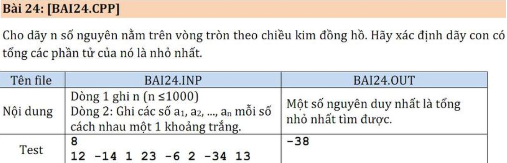

#  NNLT_BAI_24
Sample Input 0
```
8
12 -14 1 23 -6 2 -34 13
```

Sample Output 0
```
-38
```

Sample Input 1
```
8
2 -14 1 23 -6 2 -34 1
```

Sample Output 1:
```
-49
```

A **circular array** is a data structure where the last element is connected to the first element, forming a circular structure.

**Mảng con** là một phần liên tục của mảng. Nó có thể là một phần tử của mảng hoặc một phần nào đó của mảng. Mảng con liền kề có tổng lớn nhất có nghĩa là mảng con có giá trị tổng lớn nhất.

**Ví dụ:** một mảng là `{-10, 5, 1, 6, -9, 2, -7, 3, -5}`. Các mảng con của nó có thể là: `{-10,5,1,6}` hoặc `{5,1,6}` hoặc `{2,7,3, -5}`, v.v. Nhưng `{5,1,6,3}` không thể là một mảng con vì chúng không duy trì trình tự.
### NOTE:


## Notes for the noobs:
```push_back()``` : [check this](https://www.geeksforgeeks.org/cpp/vector-push-back-cpp-stl/)


